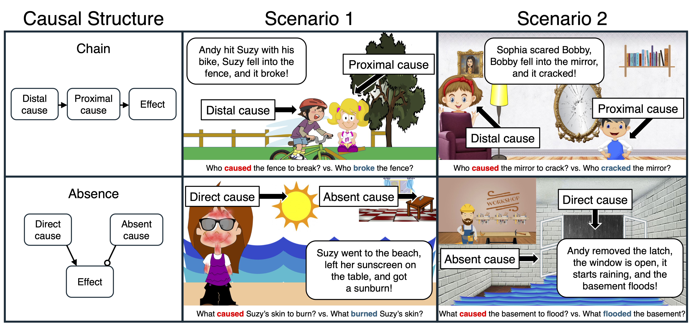

## How children map causal verbs to different causes across development

This repository contains the experiments, data, analyses, and figures for the paper "Who caused it to break? Who broke it? How children map causal verbs to different causes across development" by David Rose, Siying Zhang, Shaun Nichols, Ellen Markman and Tobias Gerstenberg.

<!-- The preprint can be found [here](update link) -->

__Contents__:
- [Introduction](#Introduction)
- [Repository structure](#Repository-structure)

## Introduction



<br clear="left" />
<br clear="right" />

Although collision-like causes are fundamental in philosophical and psychological theories of causation, humans conceptualize many events as causes that lack direct contact. We argue that how people think and talk about different causes is deeply connected and investigate how children learn this mapping. If Andy hits Suzy with his bike, Suzy falls into a fence and it breaks, Andy "caused" the fence to break but Suzy "broke" it. If Suzy forgets sunscreen and gets sunburned, the absence of sunscreen "caused" Suzy’s sunburn, but the sun "burned" her skin. We tested 691 children and 150 adults. Four- year-old children mapped “caused” to distal causes and “broke” to proximal causes (Experiment 1). Though four-year-old children didn’t map “caused” to absences until later (Experiment 2), they already referred to absences when asked “why” an outcome occurred (Experiment 3). Our findings highlight the role of semantics and pragmatics in developing these mappings. 


## Repository structure

```
├── code
│   ├── R
│   └── experiments
│       ├── experiment1
│       ├── experiment2
│       └── experiment3
├── data
│   ├── experiment1
│   ├── experiment2
│   └── experiment3
├── docs
│   ├── experiment1
│   ├── experiment2
│   └── experiment3
├── figures
│   ├── experiment1
│   ├── experiment2
│   └── experiment3


```

- `code/` contains all the code for the experiments, analyzing data and generating figures.
  - `R` contains the analysis scripts that were used to analyze data and generate figures
	 (view a rendered file [here](https://davdrose.github.io/cause_burn_development/)).
  - `experiments` contains code for each experiment that was run. Pre-registrations for all experiments may be accessed via the Open Science Framework [here](UPDATE). All experiments with adults were run in jsPsych and all experiments with children were run in Lookit. 
	- `experiment1` 
		- `caused`
			- adults ([pre-registration](https://osf.io/wfg3p)) 
			- children ([pre-registration](https://osf.io/e2buz)) 
		- `made`
			- adults ([pre-registration](https://osf.io/achv6)) 
			- children ([pre-registration](https://osf.io/ph5tr)) 
	- `experiment2` 
		- `caused`
			- adults ([pre-registration](https://osf.io/f7k59)) 
			- children (4- 6) ([pre-registration](https://osf.io/u3g8r)) and (7- 9) ([pre-registration](https://osf.io/3ha4k)) 
		- `made`
			- adults and children ([pre-registration](https://osf.io/ybsc5)) 
	- `experiment3`
		- adults and children ([pre-registration](https://osf.io/29k5h)) 
- `data/` contains anonymized data from all experiments
- `docs/` contains all the experiment code for the adult versions of each experiment. You can preview the experiments below:
    - Experiment 1 - [caused vs lexical](https://davdrose.github.io/cause_burn_development/experiment1/cause/index.html),
      [made vs lexical](https://davdrose.github.io/cause_burn_development/experiment1/made/index.html)
    - Experiment 2 - [caused vs lexical](https://davdrose.github.io/cause_burn_development/experiment2/cause/index.html),
      [made vs lexical](https://davdrose.github.io/cause_burn_development/experiment2/made/index.html)
	- Experiment 3 - [explanation](https://davdrose.github.io/cause_burn_development/experiment3/index.html)
- `figures/` contains all the figures from the paper (generated using the script in `code/R/`). 
